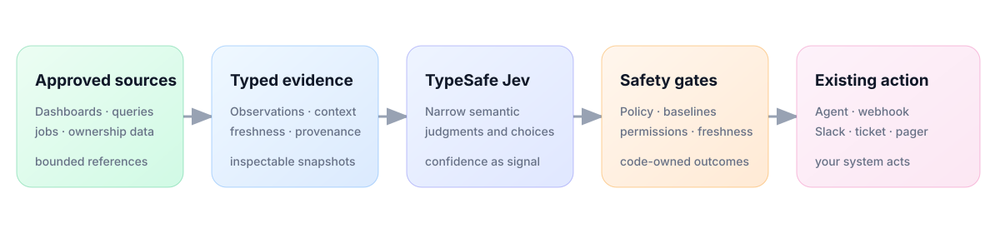

<p align="center">
  
</p>

<p align="center">
  <strong>Typed decisions for the signals your company already has.</strong><br>
  Turn dashboards, queries, jobs, and source context into evidence-backed results.
</p>

<p align="center">
  <a href="https://github.com/waddle-zoo/signal-weave/actions/workflows/ci.yml"></a>
  <a href="https://www.python.org/"></a>
  <a href="LICENSE"></a>
</p>

Most companies already know what they want to watch. The hard part is not making
another dashboard. It is getting an agent to understand a set of dashboards,
charts, notebooks, queries, and operational signals well enough to check them,
spot what matters, and run the right bounded workflow without a person opening
everything every morning.

SignalWeave is a small open-source MCP and webhook service for that seam. A
person writes a free-form insight card, source adapters return bounded evidence,
[TypeSafe Jev](https://docs.typesafe.ai/introduction) makes narrow typed
judgments, and your existing agent, scheduler, or delivery system decides what
to do next.

<p align="center">
  
</p>

## Quick start

Requirements: Python 3.11+, [uv](https://docs.astral.sh/uv/), and a TypeSafe API
key.

```bash
git clone https://github.com/waddle-zoo/signal-weave.git
cd signal-weave
uv sync --extra dev
export TYPESAFE_API_KEY_FILE=/absolute/path/to/apikey_typesafe
make verify
```

Run the optional localhost Superset demo (the first shipped connector):

```bash
TYPESAFE_API_KEY_FILE=/absolute/path/to/apikey_typesafe \
  docker compose up --build
```

Superset is available at <http://localhost:8088>. SignalWeave serves MCP at
<http://localhost:18000/mcp>, health at <http://localhost:18000/healthz>, and
push evaluation at `POST /webhooks/evaluate`. The demo credentials are
`admin` / `admin`; the loopback demo token is `local-dev-token`. Ports are
loopback-only and must not be exposed. Set `SIGNALWEAVE_API_TOKEN` and
`PUSH_WEBHOOK_TOKEN` to real deployment secrets outside local development.

To run the included card against live local Superset:

```bash
SUPERSET_URL=http://127.0.0.1:8088 \
SUPERSET_USERNAME=admin SUPERSET_PASSWORD=admin \
TYPESAFE_API_KEY_FILE=/absolute/path/to/apikey_typesafe \
  uv run python scripts/live_card_check.py \
  --card examples/insight-card.json
```

## The card

The user-facing contract is intentionally generic:

```json
{
  "title": "Sales pulse",
  "what_to_watch": "Revenue and related dashboard signals.",
  "why_watch": "Help Revenue Operations distinguish expected movement from a business issue.",
  "watch_for": [
    "Revenue changes materially.",
    "A related chart corroborates the movement."
  ],
  "questions": [
    "Is this outside expected seasonal behavior?",
    "Does this warrant a Revenue Operations response?"
  ],
  "sources": [
    {
      "key": "sales-dashboard",
      "adapter": "superset",
      "resource": "dashboard:7",
      "label": "Sales dashboard",
      "parameters": {"chart_ids": ["62", "64"]}
    }
  ],
  "delivery_methods": [
    {
      "key": "revenue-operations",
      "outcome": "notify",
      "label": "Revenue Operations",
      "destination": "slack://revenue-operations",
      "instructions": "Notify when the evidence supports a non-urgent response."
    }
  ]
}
```

In plain language:

- `what_to_watch` says what the card is about;
- `why_watch` says which decision it should support;
- `watch_for` optionally names conditions to surface one by one;
- `questions` optionally names questions the evidence should answer; and
- `delivery_methods` maps outcomes to caller-owned destinations.

The result gives you the chosen `outcome`, configured delivery methods,
per-item `watch_results`, per-question `question_results`, every normalized
observation, source evidence, confidence, and provenance. If the card names 100
things to watch, Jev receives all 100 observations; changed rows are only placed
first for client rendering.

## MCP flow

An existing UI or agent can guide onboarding without SignalWeave owning the UI:

```text
onboard_insight_card(what_to_watch, why_watch, watch_for?, questions?, ...)
discover_insight_sources(goal, adapter?, limit?)
propose_insight_card(what_to_watch, why_watch, watch_for?, questions?, ...)
resolve_insight_sources(card_id)
simulate_insight_card(card_id)
approve_insight_card(card_id)
evaluate_insight_card(card_id)
get_decision_receipt(idempotency_key? | receipt_id?)
```

For the fastest path, `onboard_insight_card` is the single-call contract: it
returns a Jev-ranked bounded catalog, a typed execution plan, a persisted draft,
review blockers, setup questions, and the next action for the caller-owned UI or
agent. It always returns `approval_required=true` and `delivery_enabled=false`.
Use the lower-level calls when a UI wants to make discovery, source selection,
simulation, or approval separate screens.

Or, when source refs are already known:

```text
draft_insight_card(title, what_to_watch, why_watch, sources, ...)
```

The proposal path uses Jev to rank a bounded source catalog, stores a draft, and
returns setup questions. Preview is delivery-disabled. Approval is explicit.
Proposal-created cards default to `retrieval_mode="expand"`: the selected source
stays a human-approved anchor, while Jev can add a bounded set of authorized,
optional context sources at evaluation time. `resolve_insight_sources` previews
that bundle. Direct drafts default to `fixed`; set `retrieval_mode="expand"` if
the caller wants the same related-source behavior.
After approval, an existing scheduler or alert relay posts:

```json
{"card_id": "card-sales-pulse"}
```

The caller owns scheduling, delivery, retries around the sink, and side effects.
SignalWeave records a durable `shadow` receipt with delivery disabled, and
replays completed results for the same evaluation idempotency key. A caller can
recover the full result later with `get_decision_receipt`, using either the
scheduler key or the returned receipt id.

The narrow shadow-pilot contract and its proof commands are documented in
[`docs/shadow-pilot-contract.md`](docs/shadow-pilot-contract.md).

Cards created through the proposal path also default to one bounded investigation
stage. Jev first decides whether the initial evidence needs more context, then
scores a small set of authorized read-only candidates. SignalWeave fetches only
the selected candidates and runs the final judgment over the combined evidence.
The result includes the selected sources, omitted candidates, context version,
typed evidence roles (`driver`, `corroborates`, `contradicts`, `quality`, or
`unknown`), and an explicit abstention warning when no follow-up is justified.
Set `investigation_mode="none"` for a fixed-evidence card.

An existing agent or graph service can provide a versioned context snapshot when
calling `simulate_insight_card` or `evaluate_insight_card`:

```json
{
  "provider": "company-context",
  "version": "graph-2026-09-18T10:00Z",
  "facts": [
    {
      "fact_id": "edge-123",
      "subject_ref": "superset|dashboard:7",
      "relation": "diagnosed_by",
      "object_ref": "superset|dashboard:12",
      "statement": "Checkout conversion is diagnosed by payment failures.",
      "provenance": ["owner:growth", "source:metric-catalog"]
    }
  ]
}
```

Context supplied through MCP is marked `unverified` and is evidence for the run,
not a silent policy update; if non-empty unverified context would support an
automatic `notify` or `escalate`, the result is downgraded to `investigate`. A
server-side `ContextProvider` can supply trusted context from a deployment-owned
system. Cards and graph changes remain caller-owned and reviewable.

## Bootstrap and certify before push

SignalWeave includes a read-only bootstrap check for each installed adapter. A
deployment supplies a real probe goal and the capabilities it requires; the
`assess_bootstrap` MCP tool reports authorized catalog coverage, native bounded
search, sample inspection, tenant scope, and optional freshness/lineage metadata.
It reports a local catalog scan as a review warning instead of presenting it as
large-catalog readiness.

Before activating a card, replay owner-labeled snapshots through the same Jev
engine with `evaluate_card_workflow`. The report keeps labels outside Jev and
measures outcome accuracy, delivery exactness, evidence recall, retrieval
precision/recall, unsafe-action rate, errors, and latency. Its `blocked`,
`shadow`, or `approved` status is a promotion signal, not a claim that Jev is
universally correct.

For onboarding retrieval, `RetrievalQualityEvaluator` reports candidate-pool
recall separately from Jev's recommended-set precision and recall. That makes a
missing catalog relationship, an incorrect Jev ranking, and a downstream card
decision three different failures to fix. The reusable contracts and example
fixture shape are documented in
[`docs/bootstrap-and-certification.md`](docs/bootstrap-and-certification.md).
The full synthetic Jev-only enterprise trial and its adversarial gate are in
[`docs/generalized-readiness-trial.md`](docs/generalized-readiness-trial.md).

## Plain-language metric queries

For data-lake questions, use a metric query card over an approved Trino catalog:

```text
propose_metric_query_card(question, why, selected_sources, dimensions?, time_grain?)
compile_metric_query_card(card_id, window_start, window_end)
approve_metric_query_card(card_id, actor?)
```

Jev selects among catalog-owned metric definitions. SignalWeave then compiles a
typed plan into deterministic `SELECT` SQL with approved relations, columns,
aggregations, dimensions, and a required partition/time bound. It never accepts
raw SQL from the MCP caller and never asks Jev to generate executable SQL. The
included Trino adapter can execute only those compiled queries and returns bounded,
normalized observations.

## Why Jev instead of one large prompt?

Embeddings and RAG can retrieve a relevant dashboard, definition, owner, or
document. They do not by themselves provide a stable boundary for deciding when
several signals belong together, when context explains a movement, or when the
evidence is unsafe to act on.

SignalWeave uses Jev as a programmable decision primitive, not an autonomous
agent. Jev selects from a finite capability vocabulary and evaluates the card's
watch items, questions, and outcome conditions with typed probabilities. Code
keeps ownership of baselines, freshness, allowlists, confidence routing, and
side effects. In the bounded investigation path, Jev also scores candidate
evidence for explanatory usefulness; it does not generate a tool call, query, or
destination. Destinations never come from model output.

That combination gives a person natural-language flexibility without turning the
whole source state and action policy into one untestable response. It also means
an existing agent can enrich the state with approved knowledge-graph context or
human feedback later without SignalWeave owning the graph or the agent loop.

## Analytical artifact integrations

The core unit is an analytical artifact set, not a Superset dashboard. An
adapter can expose a BI dashboard or chart, a saved query, a notebook/project,
a data-lake result, a data-quality check, or a workflow status. A single card can
combine artifacts from different systems when that is what the owner's question
requires. Jev ranks and judges the bounded evidence; code owns source execution,
freshness, permissions, and side effects.

The first shipped connector is Apache Superset. Hosted Preset, Hex, and Looker
connectors now use the same adapter contract while the core remains
vendor-neutral. They are read-only by default and keep provider credentials
outside cards and MCP payloads. See [`docs/hosted-connectors.md`](docs/hosted-connectors.md)
and [`docs/preset-integration.md`](docs/preset-integration.md) for the Preset
quickstart and hosted deployment boundary.
See the official [Looker API](https://cloud.google.com/looker/docs/api-getting-started)
and [Hex public API](https://learn.hex.tech/docs/api-integrations/api/overview)
documentation for the source capabilities those adapters map.

SignalWeave does not assume Superset RBAC or impose a universal enterprise ACL.
Each adapter runs under the deployment's approved credentials or identity
gateway and must return only the artifacts that caller is allowed to use. A
source without native per-user permissions should be placed behind an approved
gateway or isolated deployment; that security decision belongs to the source
integration, not to a hidden SignalWeave default.

## Hosted BI without self-hosting SignalWeave

Customers can connect hosted Preset, Hex, or Looker workspaces to a separate
SignalWeave deployment. The connection stores only a tenant-scoped credential
reference; the source secret stays in the deployment's vault. The connector
retrieves bounded metadata or cached results, Jev evaluates the approved card,
and the customer's existing agent, scheduler, and delivery system owns the
next action.

```text
hosted BI workspace -> SignalWeave adapter -> typed evidence -> Jev -> agent
```

The repository includes the provider clients, read-only adapters, explicit
metadata/cached/live data policies, and contract tests using realistic hosted
API responses. Cloud OAuth, KMS-backed secret storage, and managed polling are
deployment work; they are intentionally outside the source adapter. See
[`docs/hosted-connectors.md`](docs/hosted-connectors.md).

For Preset specifically, this direct API connector requires a Preset plan with
API access; Preset currently documents that API as Enterprise-only. Other
customers can connect an agent to Preset's remote MCP and SignalWeave's MCP as
an interim, agent-mediated path, but that path is weaker for unattended push
monitoring.

For the Preset-specific integration proof—varied chart/result shapes, partial
provider failures, token refresh, metadata-only behavior, and fail-closed
response limits—run `make preset-trial` and read
[`docs/preset-integration-trial.md`](docs/preset-integration-trial.md).
The real-account onboarding/shadow acceptance gate is `make preset-live-trial`;
it requires tenant-scoped credentials, a live Jev key, and explicit human
approval. Passing the fixture trial is not a substitute for that customer gate.

SignalWeave is not a replacement for Temporal, Airflow, Dagster, a BI tool,
Glean, a knowledge graph, or a general-purpose agent framework. It is the typed
decision layer between those systems.

## Evidence and limits

The repository includes reproducible synthetic trials, not a substitute for a
customer's historical holdout. The controlled Jev decision matrix covered 3
companies, 22 personas, 1,664 heterogeneous resources, and 144 tasks: the latest
live Jev run made 130/144 exact outcome decisions, with all fourteen misses
conservative
`notify` → `investigate` routes. That runner supplied hidden source refs, so its
source-selection result is not a discovery score.

A stricter live onboarding replay withheld expected labels from Jev and covered
eight heterogeneous cases: 8/8 required-candidate recall, 8/8 safe outcomes,
7/8 exact recommendation sets, and 0 tenant leaks. The one mismatch was held
for human review as a definition conflict. The current deterministic wiring
rerun is deliberately reported separately: 100/144 exact decisions, with 0
unsafe automatic actions and complete workflow/card/provenance/source-selection
contracts. Its 44 mismatches are not Jev evidence; they are retained as a
failed research baseline. See [`docs/live-jev-onboarding-2026-09-25.md`](docs/live-jev-onboarding-2026-09-25.md)
and [`docs/adversarial-v1-review-2026-09-25.md`](docs/adversarial-v1-review-2026-09-25.md).

The independent live discovery trial used 48 tasks, 576 resources before tenant
filtering, same-name cross-tenant decoys, and two-source labels that were not sent
to Jev. It achieved 48/48 exact top-2 sets, 48/48 top-10 coverage, and 0 wrong-
tenant returns with an explicit tenant boundary. The live metric-plan trial used
24 held-out metric labels and achieved 24/24 correct definitions, dimensions, and
time grains; all 24 compiled queries were bounded, `SELECT`-only, and semicolon-
free. The live evidence-bundle trial used the same 48-task catalog with a
human-approved anchor and independently held-out related-source labels: 48/48
expected related sources were selected, 48/48 anchors were preserved, and 0
wrong-tenant sources were returned. Run it with `make bundle-trial`. These are
synthetic regression measurements, not universal accuracy or production safety
claims.

The MCP enterprise trial also exposed the limits: malformed client calls and
unscoped catalogs caused source-discovery failures. Keep tenant identity, metric
definition, population, grain, freshness, lineage, and source status in adapter
metadata, and run a domain-owner-labeled, time-split shadow trial before enabling
automated actions.

The live adversarial retrieval-and-explanation fixture covers SaaS, retail,
logistics, fintech, and marketplace cases with same-name tenant decoys, graph
context, stale evidence, related and unrelated dashboards, and a no-diagnostic
case. The current five-case run made 5/5 exact outcome decisions, 5/5 exact
delivery decisions, selected only authorized sources in 5/5 cases, and averaged
0.70 recall over the labeled optional diagnostic-source set. This is a synthetic
stress test; the imperfect source recall is intentionally visible and is not a
production accuracy claim. Re-run it with `make retrieval-explanation-trial`.

The default runtime stores insight cards, metric cards, and decision receipts in
one SQLite file. Its database uniqueness constraint makes a completed
idempotency key replayable after restart. Multi-replica deployments should
provide a shared transactional store through the store interfaces before routing
traffic to more than one evaluator process.

Operator labels are also durable and retry-safe when the caller supplies a
stable `feedback_id` to `record_decision_feedback`. Labels are linked to the
receipt's card and context versions; revising a card later cannot rewrite what
the operator labeled about an earlier run.

See [`docs/evidence-brief.md`](docs/evidence-brief.md) for the measured case and
limitations.

To reproduce the scheduled analytical-artifact monitor contract—no-change
suppression, contextual notification, complete evidence, and idempotent
scheduler retry—run `make daily-trial`. The current fixture uses Superset-shaped
artifacts because Superset is the first shipped connector; the engine contract
does not require that shape. It is an integration proof, not a universal
accuracy claim.

## Documentation

- [`docs/architecture.md`](docs/architecture.md) — contracts, pipeline, and boundaries
- [`docs/demo.md`](docs/demo.md) — local setup and onboarding walkthrough
- [`docs/enterprise-v1-acceptance.md`](docs/enterprise-v1-acceptance.md) — v1 acceptance gates, deployment modes, and evidence
- [`docs/source-adapters.md`](docs/source-adapters.md) — adapter contract and security boundary
- [`docs/metric-query-cards.md`](docs/metric-query-cards.md) — approved catalogs, Trino plans, and SQL bounds
- [`docs/benchmark.md`](docs/benchmark.md) — comparison methodology
- [`docs/evidence-brief.md`](docs/evidence-brief.md) — measured product case
- [`docs/enterprise-experiment.md`](docs/enterprise-experiment.md) — MCP-only enterprise readiness experiment
- [`docs/enterprise-closure.md`](docs/enterprise-closure.md) — current proof boundary and next gate
- [`docs/enterprise-readiness-report-2026-09-25.md`](docs/enterprise-readiness-report-2026-09-25.md) — high-level product-value, landscape, evidence, and enterprise-readiness assessment
- [`docs/adversarial-v1-review-2026-09-25.md`](docs/adversarial-v1-review-2026-09-25.md) — security, retrieval, packaging, and release verdict for the reviewed branch
- [`docs/adversarial-review.md`](docs/adversarial-review.md) — public-readiness review and explicit gaps
- [`docs/retrieval-explanation.md`](docs/retrieval-explanation.md) — bounded investigation contract and adversarial trial
- [`docs/postfix-agent-trial.md`](docs/postfix-agent-trial.md) — live post-fix Luna agent trial
- [`docs/security.md`](docs/security.md) — credentials and deployment notes
- [`ROADMAP.md`](ROADMAP.md) — future work tracker
- [`CONTRIBUTING.md`](CONTRIBUTING.md) — setup and pull-request guidance
- [`AGENTS.md`](AGENTS.md) — guidance for coding agents

## License

SignalWeave is available under the [Apache 2.0 license](LICENSE).
